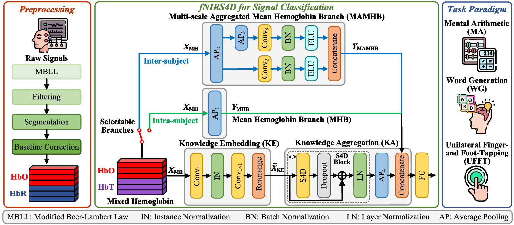
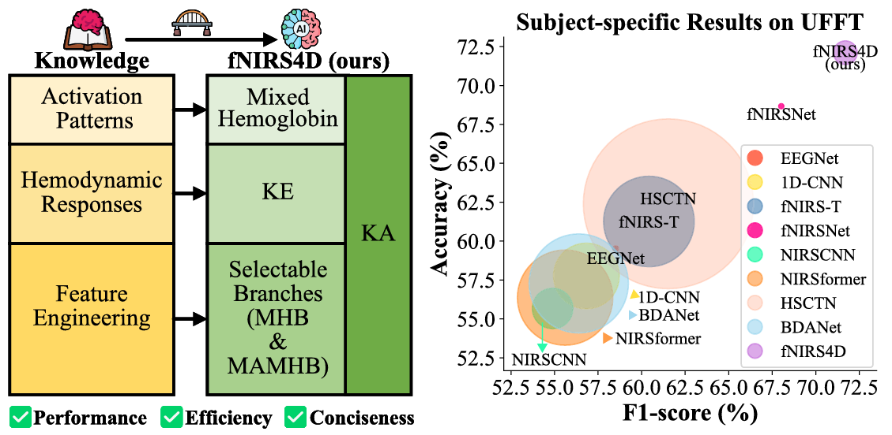

# fNIRS4D

## Domain Knowledge Fused State Space Model for fNIRS-Based Brain–Computer Interfaces

After more than two years of submitting manuscripts, our paper titled *Domain Knowledge Fused State Space Model for fNIRS-Based Brain–Computer Interfaces* (https://ieeexplore.ieee.org/document/11522669) has been accepted by IEEE Transactions on Instrumentation and Measurement.

The code will be published in this repository.

## Abstract
Many studies focus solely on DNNs but neglect the importance of fNIRS domain knowledge. We refine domain knowledge into neuroscientific knowledge and expert prior. This article aims to integrate domain knowledge into DNNs, including activation patterns, hemodynamic responses, and feature engineering. Diagonally structured state space sequence model (S4D), simple and efficient diagonal versions of SSMs, are introduced to the fNIRS domain. We incorporate domain knowledge into an S4D-based lightweight fNIRS classification model named fNIRS4D. Further analysis shows that domain-knowledge-inspired methods can form a general fNIRS framework, improving the learning capabilities and classification performance of existing methods without fine-tuning.

    
    

